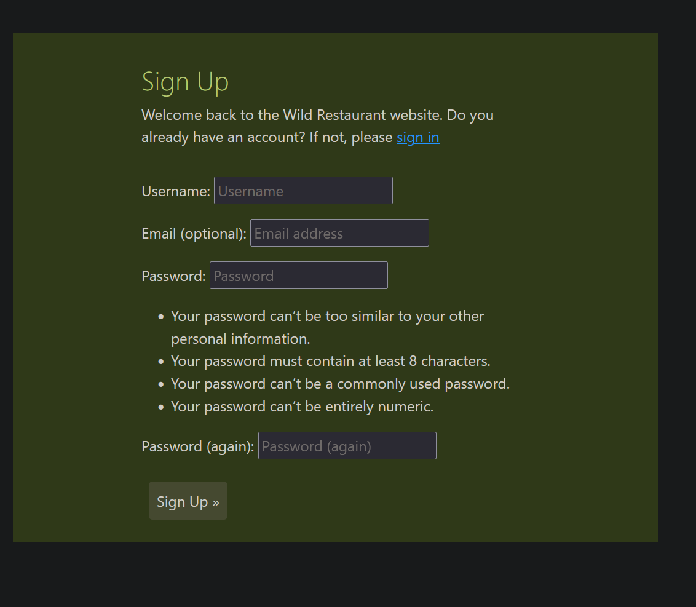
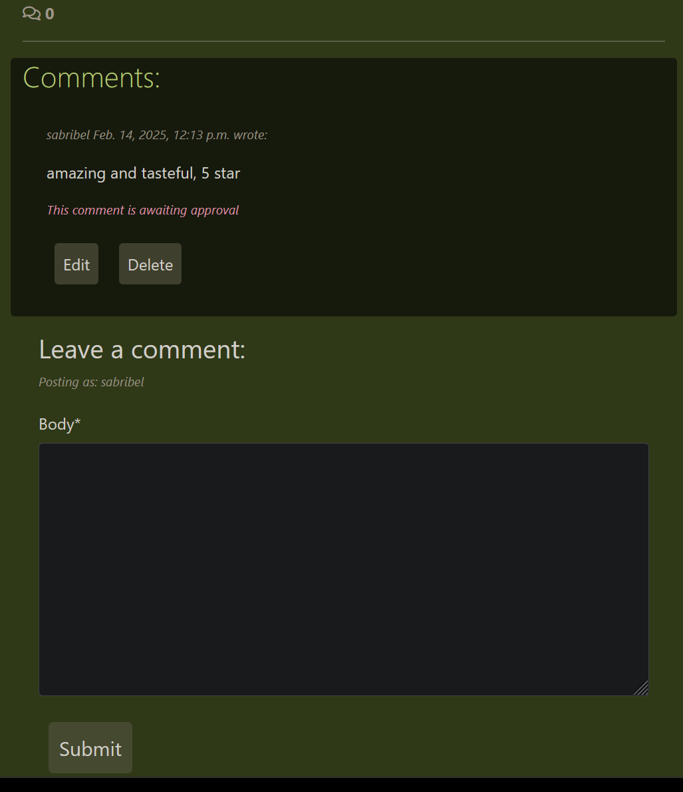
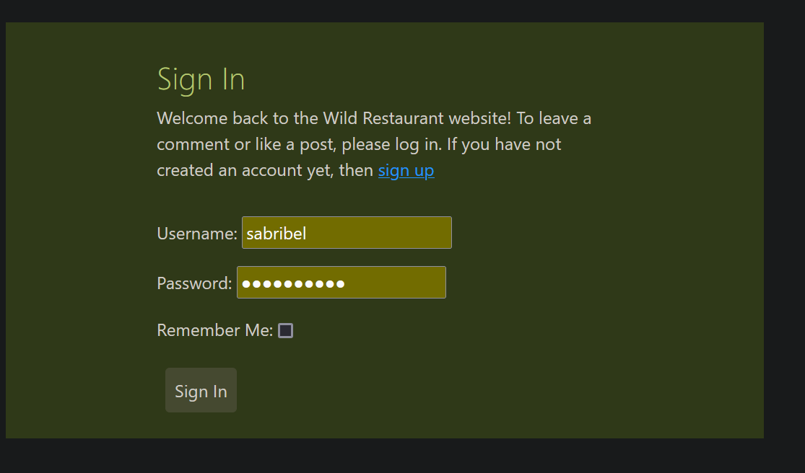
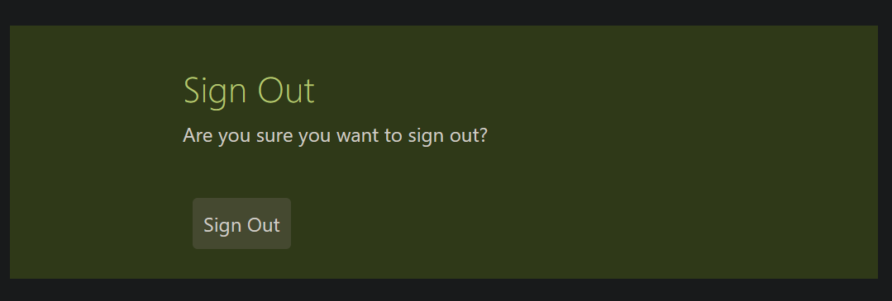
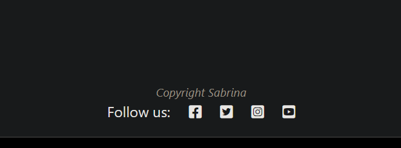

# Wild Restaurant 
This  project is a Django web application built for people who enjoy Restaurant and Hunting. It is targeted towards people who like to eat wild animals hunted in the nature. The purpose of this site is to allow users to see the menu, comment on each dish and meet the staff behind the grill. User can also contact the restaurant for book for any special occasion during the peak periods.

[live project link](https://wild-restaurant-ea4797fea1e4.herokuapp.com/)

## User Experience (UX)

### Project Goals:
The primary goal for this project is to create a webpage for display dishes, staff and all the related information of the restaurant with an additional reservation option. 
This page enables full CRUD functionality to registered users so that they can Create, Read, Update and Delete comments directly on the selected dish.

### Strategy:
An Agile methodology was used to plan this project. This was implemented using a Kanban board in GitHub Project with linked Issues. 
To check the agile methodology used, the user stories and the issues click on the following link, it will open the gitHub project page with all the information:
[git hub user stories](https://github.com/users/Sabri-bel/projects/2/views/1)
or you can access to the project link and select "project" for the specific PP4 
(gitHub link)[https://github.com/Sabri-bel/PP4]

## Features

### Existing Features

#### Navigation bar:

The navbar is present on all pages of the site,

On the left-hand side of the navbar the user is presented with the Restaurant logo which when clicked will redirect the user to the home page.

Based on the screen size, the navigation links can be placed in different way:
- mobile and small screens:
The right-hand side contains the navigation links as burger icon menu for the other pages of the site and depending on login status the following link will be present:
  - Not logged in: Home, Blog, Register, Login

- desktop and larger screens:
The navigation links are placed in the right side, just after the Restaurant logo. 

#### Home page:

##### Home page - Menu section:

This is first presented to the user as they visit the site. It consist of a list of dishes with photos 

At the bottom there is the footer section, for the social link (link not included yet)

#### Post detail page:

When a user chooses to click on each specific post, they are brought to the Post detail page. The user is shown the entirety of the post with a commenting section below. The user will be able to interact with the content depending on user status.

The following information will be presented to the user:
  - dish image 
  - Title - Post title
  - Author - post author
  - Date created - Post created on
  - brief description of the dish and the allergens
  - Number of comments - Font Awesome icon (fas fa-comments) followed by number of comments
  - Comments 

Features dependent on user status:

  - User not logged in:
The comment form is not displayed to the user, but he can see the comments. User can clearly see a message that leave a comment requires login.
- User is logged in:
The comment form is presented to the user and the user can comment on the post. Once the user clicks on Submit, the comment is visible only to the user and wait for admin approval. 
  - User is the post author:
The post author will have full CRUD functionality over their posts.
They are presented with the option to update or delete their post.

Delete post will open a modal for confirming deletion of the post; a modal is displayed to the user with the option to Delete or Cancel.

#### Register page:

To interact with the site, a user is required to register and login.
The Register page can be accessed:
  - Using the provided navbar link

A new account can be easily created. The user needs to provide the following information:
  - Username - must be unique
  - E-mail - optional
  - Password - which must be entered twice

When all fields are complete and the user clicks on register and new account is automatically created and the user is redirected to the Home page.

#### Login page:

For full CRUD functionality a user is required to login to the site.

The Login page can be accessed:
  - Using the provided navbar link

The user needs to enter the following information:
  - Valid username
  - Correct password

When the user enters a correct username with a matching password and clicks on Login, they are logged in and redirected to the Home page.

#### Logout page:

The Logout page can be accessed using the provided navbar link that is present when a user is logged in. When the user clicks on Logout, they are directly logged out of their account and redirected to the Home page.

#### Django Admin page:

To manage the blog content of the site, a superuser account was created. This allows a superuser to administer the site. The Admin page/panel can easily be accessed by logging in to the /admin URL with the superuser account.
From the admin panel, the superuser will be able to delete a specific post, delete and approve comment, team member or user.  

#### System messages:

System notification messages are present throughout the site and will be displayed to the user as feedback when certain actions are completed or not when the user interact with the page. The message will appear at the top of the screen just under the navigation bar.

#### Footer:

The Footer is present on all pages of the site, featured at the absolute bottom. 
A link for the main social is present at the center of the section.

### Data Model

This project is hosted on Heroku and the database used is PostgreSQL. 
Cloudinary is used to store all blog images.
A custom model was created for this project: team members, and it is required for add/remove the staff information in the about page (admin). 

### Images

All current images used on the site were downloaded from the following websites:
- Unsplash
- Pexels

## Technologies Used

### Languages Used:

  - HTML5
  - CSS3
  - JavaScript
  - Python

  ### Frameworks and Libraries Used:

  - [Bootstrap:](https://getbootstrap.com/) Bootstrap CSS Framework used for styling and to build responsive web pages.
  - [Cloudinary:](https://cloudinary.com/) Used to store all blog images and uploaded images.
  - [Django:](https://www.djangoproject.com/) Main Python framework used in the development.
  - [Django Allauth:](https://django-allauth.readthedocs.io/en/latest/index.html) Used for authentication and account registration.
  - [Django Crispy Forms:](https://django-crispy-forms.readthedocs.io/en/latest/) Used to simplify the rendering of Django forms.
  - [dj_database_url:](https://pypi.org/project/dj-database-url/) Used to allow database urls to connect to the postgres database.
  - [Gunicorn:](https://gunicorn.org/) Green Unicorn, used as the Web Server to run Django on Heroku.
  - [psycopg2:](https://pypi.org/project/psycopg2/) Used PostgreSQL database adapter.
  - [Summernote:](https://github.com/summernote/django-summernote) To provide a WYSIWYG editor for customizing new blog content and add images.

### Software and Web Applications Used:

- [Am I Responsive:](http://ami.responsivedesign.is) Checking the responsive.
- [Chrome DevTools:](https://developer.chrome.com/docs/devtools/) Used to test the response on different screen sizes, debugging and to generate a Lighthouse report to analyze page load.
- [Font Awesome:](https://fontawesome.com/) Used throughout the site to add icons for aesthetic and UX purposes.
- [GitHub:](https://github.com/) GitHub is used to store the projects code after being pushed from Git and to create the Kanban board used 
for this project.
- [Google Fonts:](https://fonts.google.com/) To import font family which is used throughout the site. Added fallback font sans-serif.
- [Heroku:](https://www.heroku.com/) For deployment and hosting of the application.
- [HTML Validator:](https://validator.w3.org/) Check your code for HTML validation.
- [JSHint:](https://jshint.com/) Check code for JavaScript validation.
- [W3 CSS Validator:](https://jigsaw.w3.org/css-validator/) Check your code for CSS validation.

## Testing

I have tested that this application works on different screen sizes.  IMPORTANT: Unfortunately, am I unresponsive was not working during the testing, so a screenshot cannot be provided
  - I have tested all the features including:
    - login fetures with multiple users
    - logout features and confirmation modal with multiple users 
    - register features with multiple users
    - CRUD functionality of the comments in every single post:
        - verified the confirmation modal is working with the delete process
        - verified the approval process for the comments
    - admin django page functionality:
        - created and deleted sucessfully users, staff members, post and comments

### Browser Testing

I have tested that this application works using Windows PC using the following browsers:

  - Safari 
  - Google Chrome 
  - Firefox 

I have tested this application works on the following mobile devices:
  - Google Pixel 8 pro
  - iPad Pro

### Responsiveness

Chrome developer tool have been used to check the responsiveness.

### Validator Testing

#### W3C Markup Validator:

The W3C Markup Validator were used to validate the HTML on all pages of the project to ensure there were no syntax errors in there. To validate the HTML files all Django template tags were manually removed with the HTML code copied and inserted to the base template.

#### W3C CSS Validator:

The W3C CSS Validator Services were used to validate the CSS to ensure there were no errors in there.

#### JSHint:

JSHint was used to validate the JavaScript with no errors highlighted.

#### PEP8 Online:

PEP8 Online linter (Python validator) The code passed without any errors on all files tested

### Lighthouse:

I have confirmed that the colours and fonts chosen are easy to read and accessible by running it through lighthouse in Chrome developer tools

## Deployment

The application was deployed to Heroku. The steps to deploy are as follows:

  - Login to [Heroku](https://dashboard.heroku.com/apps) dashboard to get an overview of installed apps.
  - Click on New => Create new app.
  - Choose a name for your application (must be unique) and enter your location.
  - Click on Create app.
  - After creating your new application, navigate and click on the Resources tab.
  - Navigate to the Settings tab => click on Reveal Config Vars.
  - Copy the DATABASE_URL url value as config var
  - Locally => Create a new env.py file on top level directory.
  - In the env.py file:
    - Set environment variables: os.environ[”DATABASE_URL"] = "Paste in Heroku DATABASE_URL Link”
    - Add in secret key: os.environ[”SECRET_KEY"] = "Make up your own randomSecretKey”
  - In Heroku => Navigate to the Settings tab => click on Reveal Config Vars.
  - Add SECRET_KEY to Config Vars with the randomSecretKey value previously chosen.
  - In the settings.py file:
    - Remove the insecure secret key and replace it with: SECRET_KEY = os.environ.get(’SECRET_KEY')
    - Update to use the DATABASE_URL: dj_database_url.parse(os.environ.get(”DATABASE_URL"))
  - Save all files and Make Migrations: python3 manage.py migrate
  - Login to [Cloudinary](https://cloudinary.com/) and navigate to the Cloudinary Dashboard.
  - Copy your CLOUDINARY_URL API Environment Variable to the clipboard.
  - In the env.py file:
    - Add Cloudinary URL: os.environ["CLOUDINARY_URL"] = ”cloudinary://paste in API Environment Variable”
  - In Heroku => Navigate to the Settings tab => click on Reveal Config Vars.
  - Add ’CLOUDINARY_URL’ to Config Vars with the in API Environment Variable value.
  - Add ’DISABLE_COLLECTSTATIC’ 1 to Heroku Config Vars (temporary, must be removed before final deployment).
  - In the settings.py file:
    - Add Cloudinary Libraries to installed apps (note: order is important) ’cloudinary_storage',  ’django.contrib.staticfiles', ’cloudinary',
    - Add the following code below STATIC_URL = ’/static/' to use Cloudinary to store media and static files:
      - STATICFILES_STORAGE = ’cloudinary_storage.storage.StaticHashedCloudinaryStorage'
      - STATICFILES_DIRS = [os.path.join(BASE_DIR, ’static')]
      - STATIC_ROOT = os.path.join(BASE_DIR, ’staticfiles')
      - MEDIA_URL = '/media/'
      - DEFAULT_FILE_STORAGE = 'cloudinary_storage.storage.MediaCloudinaryStorage'
    - Link file to the templates directory in Heroku: TEMPLATES_DIR = os.path.join(BASE_DIR, ’templates')
    - Change the templates directory to: TEMPLATES_DIR: 'DIRS': [TEMPLATES_DIR],
    - Add Heroku Hostname to ALLOWED_HOSTS: ALLOWED_HOSTS = [”Your_Project_name.herokuapp.com”, ”localhost”]
  - Create 3 new folders on top level directory: media, static, templates
  - Create a Procfile on the top level directory
  - In the Procfile file:
    - Add the following code with your project name: web: gunicorn PROJ_NAME.wsgi
  - In the terminal: Add, Commit and Push.
  - In Heroku navigate to the Deploy tab => click on Deploy Branch.
  - When build process is finished click on Open App to visit the live site.

## Credits

  - [Am I Responsive:](http://ami.responsivedesign.is) Checking the responsive.
  - [Bootstrap documentation:](https://getbootstrap.com/docs/4.6/getting-started/introduction/) Bootstrap documentation used for styling and to build responsive web pages.
  - [Code Institute:](https://codeinstitute.net/) Walkthrough modules in Full Stack Frameworks.
  - [Code Institute Slack Community:](https://app.slack.com/) Slack community for troubleshooting and FAQ.
  - [Code Institute Tutor Support:](https://app.slack.com/) For help and support.
  - [Django documentation:](https://docs.djangoproject.com/en/4.1/) Everything you need to know about Django.
  - [Stack Overflow:](https://stackoverflow.com) For troubleshooting and FAQ.
  - [Unsplash:](https://unsplash.com/photos/NtkCemIfaiU) Man fishing on river at daytime photo, Chris Sarsgard.
  - [W3Schools:](https://www.w3schools.com) Online Web Tutorials.
